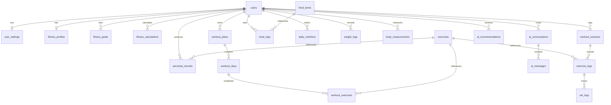

# DATABASE SCHEMA — GYMBruhh

The application uses a relational schema with 19 database tables.

## Schema Entities

1. **`users`**: Account credentials, email, hashed password, onboarding state.
2. **`user_settings`**: Unit preferences (metric/imperial), dark mode, notification switches.
3. **`fitness_profiles`**: Age, gender, height, current weight, target weight, fitness level, split preference, dietary preference.
4. **`fitness_goals`**: Goal type (muscle_gain, fat_loss, maintenance, strength), target bodyweight.
5. **`fitness_calculations`**: Deterministic BMI, BMR, TDEE, Calorie targets, and Protein/Carb/Fat targets.
6. **`exercises`**: Catalog of 50+ movements across chest, back, shoulders, arms, legs, core, cardio with biomechanical instructions.
7. **`workout_plans`**: Master training routines.
8. **`workout_days`**: Individual training days (e.g. Push, Pull, Legs).
9. **`workout_exercises`**: Target sets, reps, RPE, rest interval.
10. **`workout_sessions`**: Active and completed training logs (started_at, completed_at, total volume, PRs hit).
11. **`exercise_logs`**: Exercises performed in a workout session.
12. **`set_logs`**: Individual sets with weight (kg), reps, RPE, completed status, PR flag.
13. **`food_items`**: Nutritional database (calories, protein, carbs, fat, fiber).
14. **`meal_logs`**: Logged meals with serving sizes and timestamps.
15. **`daily_nutritions`**: Aggregate daily calories, macros, and water intake.
16. **`weight_logs`**: Weigh-in history.
17. **`body_measurements`**: Chest, waist, hips, arms, thighs, calves measurements.
18. **`personal_records`**: Estimated 1RM and volume PRs per exercise.
19. **`ai_conversations`**, **`ai_messages`**, **`ai_recommendations`**: Chat logs and progressive overload proposals.
